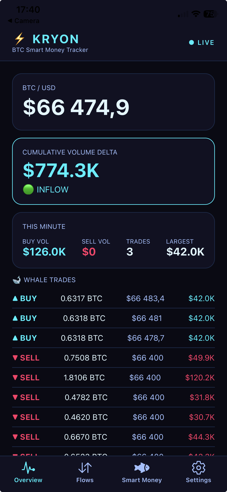

# ⚡ Kryon — BTC Smart Money Tracker

> Real-time Bitcoin whale flow tracker. See where smart money is moving before the market reacts.
> **Not financial advice — your trades, your responsibility.**



---

## What is Kryon?

Kryon is a mobile-first BTC intelligence app that answers one question in real time:

**"Is smart money flowing IN or OUT of Bitcoin right now?"**

Most traders are blind to whale movements, exchange manipulation, and spoofing. Kryon surfaces these signals in a clean, glanceable mobile UI — so you can make more informed decisions faster.

---

## Features (Current MVP)

- ⚡ **Live BTC Price** — real-time ticker from Kraken WebSocket
- 📊 **Cumulative Volume Delta (CVD)** — net buy vs sell pressure from whale trades
- 🐋 **Whale Trade Feed** — filters out noise, shows only significant moves
- 🚨 **Spoof Detection** — flags large orders that vanish from the order book
- 🔴🟡🟢 **Live Connection Status** — animated dot showing WS health
- 🔄 **Auto-reconnect** — exponential backoff (1s → 2s → 4s → 30s max)
- 💔 **Heartbeat Detection** — forces reconnect if connection goes silent

---

## Roadmap

- [ ] Binance + Bybit WebSocket integration (more volume, better signals)
- [ ] Proper spoof detection (price movement toward order → vanishes)
- [ ] Liquidation feed (Binance Futures)
- [ ] Support & Resistance zones from volume profile
- [ ] Confluence signal score (CVD + zones + whale pressure)
- [ ] Flows screen — multi-exchange trade feed
- [ ] Smart Money screen — aggregated whale intelligence
- [ ] Background mode with battery optimization
- [ ] Push notifications for large moves

---

## Tech Stack

| Layer | Tech |
|-------|------|
| Framework | Expo SDK 56 (managed workflow) |
| Language | TypeScript |
| Navigation | Expo Router (file-based tabs) |
| State | Zustand |
| Styling | twrnc (Tailwind syntax for RN) |
| Data | Kraken WebSocket v2 |
| Animations | React Native Reanimated |

---

## Architecture

```
app/
  (tabs)/
    index.tsx        # Overview — price, CVD, whale trades
    flows.tsx        # Flows — full trade feed (WIP)
    smartmoney.tsx   # Smart Money — whale intelligence (WIP)
    settings.tsx     # Settings — thresholds, preferences (WIP)

src/
  hooks/
    useKrakenWS.ts   # WS connection, reconnect, heartbeat
  store/
    flowStore.ts     # Zustand — trades, CVD, order book, spoof alerts
  theme/
    colors.ts        # Cyberpunk color palette
    tw.ts            # twrnc instance with custom colors
```

---

## Data Sources

| Exchange | Channel | Purpose |
|----------|---------|---------|
| Kraken | `trade` | CVD + whale detection |
| Kraken | `ticker` | Real-time BTC price |
| Kraken | `book` depth 10 | Spoof detection (WIP) |
| Binance | `trade` | Coming soon |
| Bybit | `trade` | Coming soon |

---

## Signal Logic

**CVD (Cumulative Volume Delta)**
```
Aggressive BUY (market order hits ask) = INFLOW
Aggressive SELL (market order hits bid) = OUTFLOW
Rising CVD + rising price = healthy bullish ✅
Rising CVD + falling price = distribution 🚨
Falling CVD + rising price = fake pump 🚨
```

**Spoof Detection (WIP)**
```
1. Large order appears in book (> 5 BTC)
2. Price moves TOWARD it (≥ 0.05%)
3. Order vanishes BEFORE being filled
4. All within 30 seconds
= 🚨 SPOOF DETECTED
```

---

## Getting Started

```bash
# Clone
git clone https://github.com/migber/kryon-v2.git
cd kryon-v2

# Install
npm install

# Start (Expo Go — SDK 54 compatible)
npx expo start
```

Scan the QR code with Expo Go on your phone.

---

## Color Palette

```
void:       #0a0a14  — background
surface:    #111122  — cards
circuit:    #1a2a4a  — borders
neon:       #00f0ff  — primary accent (cyan)
neonSoft:   #00aaff  — secondary accent
danger:     #ff3366  — sells / alerts
text:       #e0f7ff  — primary text
textMuted:  #a0c0ff  — secondary text
```

---

## Why Kryon?

I built this because I was frustrated switching between 5 different tools to understand where BTC money was actually flowing. Whale Alert, Nansen, TradingView, exchange apps — none of them gave me one clear mobile-first answer.

Kryon is that answer. Built by a solo dev, in public, with real data.

---

## Author

**Migle** — [@migber_code](https://x.com/migber_code)
Solo indie developer. Previously senior engineer at Uber Lithuania.
Building Amber Studio products.

---

## Disclaimer

Kryon is an information tool only. Nothing displayed in this app constitutes financial advice. All trading decisions are solely your responsibility. Past signals do not guarantee future results. Crypto trading involves significant risk of loss.

---

## License

MIT — use it, learn from it, build on it. Just don't blame me if BTC dumps. 😄
